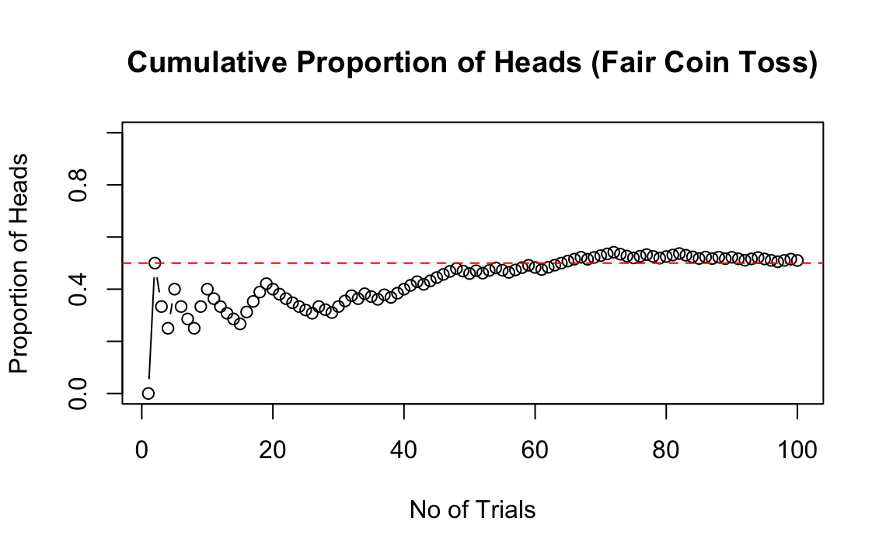

Why Bayesian at All?
======
Statistics as a subject has not been around for a long time. It had started to materialise as a discipline when gamblers realised they could mathematically quantify "chance" which facilitated their study of gains and losses. Now how we define "chance" is what leads us to the 2 schools of thought in Statistics.

<h3>The Frequentist Version</h3>

Toss a coin 100 times. Count the proportion of heads among the 100 trials. Here's a simple code to run this:

'''r
set.seed(1)

heads <- sample(c(0, 1), size = 100, rep = TRUE)

proportion_heads <- cumsum(heads) / (1:100)

plot(1:100, proportion_heads,
     xlab = "No of Trials",
     ylab = "Proportion of Heads",
     main = "Cumulative Proportion of Heads (Fair Coin Toss)",
     ylim = c(0, 1),
     type = "b")
     
abline(h = 0.5, col = "red", lty = 2)
'''

The plot will show somewthing like this:

As the no of trials increase, we can see the proportion of heads occuring converges to 0.5 -  the theoretical probability or "chance" that heads will appear when the coin is tossed. Thus we now quantify chance that heads appear as 0.5. The frequentist argues:

"As the no of trials increase, the proportion of a certain event occuring converges to its true probability"

This fact is supported by a very important theorem in probability called the <b>Law of Large Numbers</b>

Now how does a Bayesian define this notion of chance?

<h3>The Bayesian Version</h3>

A Bayesian defines "chance" as "belief in occurence of that event". Probability that Heads appear when a coin is tossed means "I believe that there is a 50% chance of heads occuring when the coin is tossed".

We interpret \\($P(A)$\\) as the strength of the argument <b>A</b> where 

\\($0$\\) implies \\($\bar{A}$\\)

\\($1$\\) implies \\($A$\\)

\\($(0,1)$\\) implies the degree of confidence in our argument.

You may ask, "Why do we care about this interpretation at all? After all, the calculations will remain the same!"

Yes, probability calculations in bayesian and frequentist views are almost same but the Bayesian interpretation of probability has more practical applications. In our day-to-day life we use probabilities to express our confidence in the statement. A 30% chance of rain hardly means out of 100 days, around 30 of them will make us traverse through the "ocean of knowledge" through the ISI campus!. It means I am not so sure about raining but it might "given the weather of the past few days". Moreover, I can't afford to fail half of my papers to tell my friends, "I have a 50-50 chance to pass this course"!. In such scenarios, we want to interpret probability as belief. Later we will learn that Every Bayes rule is admissible ( in other words, no other rule is strictly better in every scenario).

Heading 2
======

Heading 3
======
